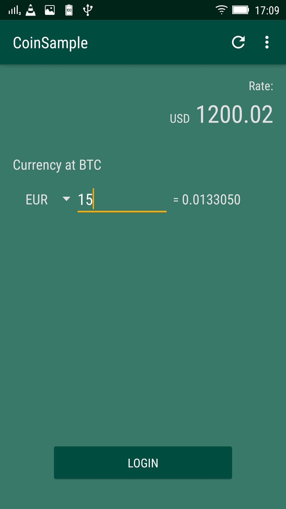
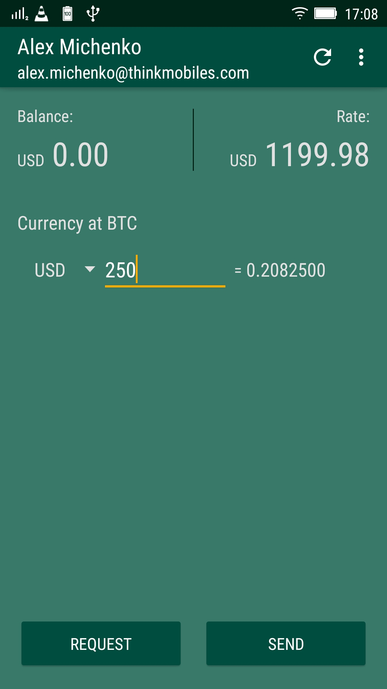
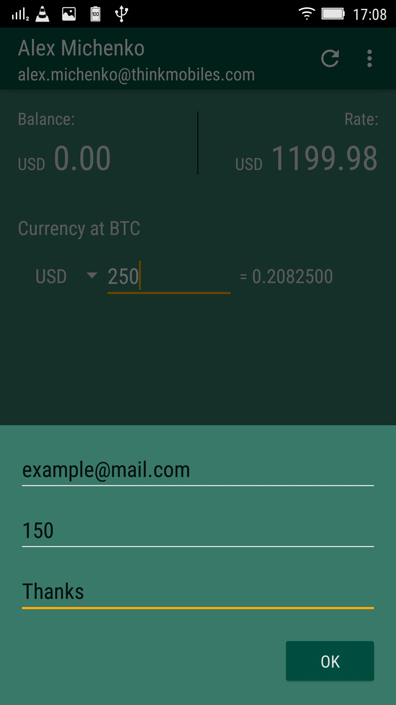

# Coinbase-Sample-Android

Sample application of using the <a href="https://github.com/coinbase/coinbase-android-sdk">Coinbase Android SDK</a> (MVP architecture).

## Functionality

Application works with official <a href="https://www.coinbase.com">Coinbase Wallet</a> and contains next features: 
* Authorization
* Get balance
* Send money to other user
* Request money from other user
* Get current exchange rate of bitcoin
* Calculate conversion of currency at bitcoin

## Screenshots
&nbsp;
&nbsp;


## Service Information
SDK tutorial https://github.com/coinbase/coinbase-android-sdk and https://github.com/coinbase/coinbase-java

In `build.gradle`:
```java
    packagingOptions {
        exclude 'LICENSE.txt'
        exclude 'META-INF/LICENSE'
        exclude 'META-INF/LICENSE.txt'
        exclude 'META-INF/NOTICE'
        exclude 'META-INF/NOTICE.txt'
    }
    
    ...
    
    dependencies {
        compile ('com.coinbase.android:coinbase-android-sdk:1.0.1') {
            exclude group: 'org.apache.httpcomponents', module: 'httpclient'
        }
        
    }
```

Authorization
```java
  ...
    private <T> Observable<T> getNetworkObservable(Observable<T> observable) {
        return observable.observeOn(AndroidSchedulers.mainThread())
                .subscribeOn(Schedulers.newThread());
    }

    public Observable<User> login(final Context context, final Uri uri) {
        return getNetworkObservable(Observable.create(new ObservableOnSubscribe<User>() {
            @Override
            public void subscribe(ObservableEmitter<User> e) throws Exception {
                OAuthTokensResponse response = OAuth.completeAuthorization(context, CLIENT_ID, CLIENT_SECRET, uri);
                SharedPref.getInstance().saveOAuthResponse(response);
                coinbase = new CoinbaseBuilder()
                        .withAccessToken(response.getAccessToken())
                        .build();
                e.onNext(coinbase.getUser());
            }
        }));
    }

    public Observable<String> redirect(final Context context) {
        return getNetworkObservable(Observable.create(new ObservableOnSubscribe<String>() {
            @Override
            public void subscribe(ObservableEmitter<String> e) throws Exception {
                OAuth.beginAuthorization(context, CLIENT_ID, "user", REDIRECT_URI, null);
                e.onNext("OK");
            }
        }));
    }
    
    ....
```
Get current bitcoin rate
```java
  ...
    public Observable<Money> getSpotPrice() {
        return getNetworkObservable(Observable.create(new ObservableOnSubscribe<Money>() {
            @Override
            public void subscribe(ObservableEmitter<Money> e) throws Exception {
                e.onNext(coinbase.getSpotPrice(CurrencyUnit.USD));
            }
        }));
    }
  ...
```


Example uses next additinal libraries:
* <a href="https://github.com/ReactiveX/RxAndroid">RxAndroid</a>

## Developers

* [Alex Michenko](https://github.com/alex-michenko)
